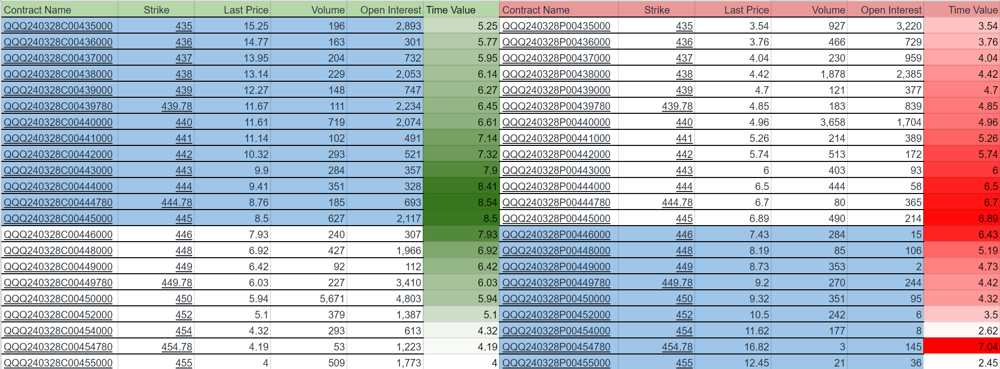
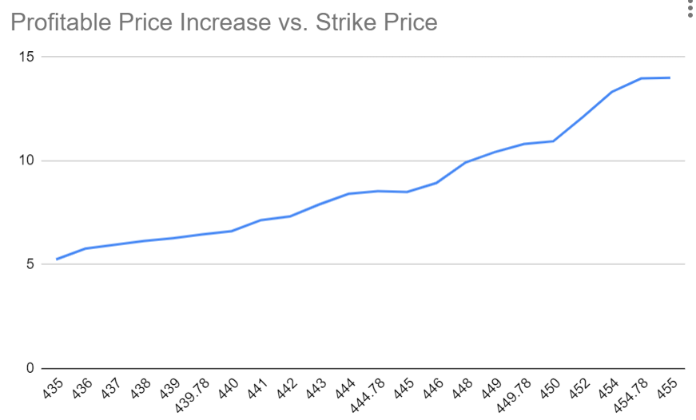
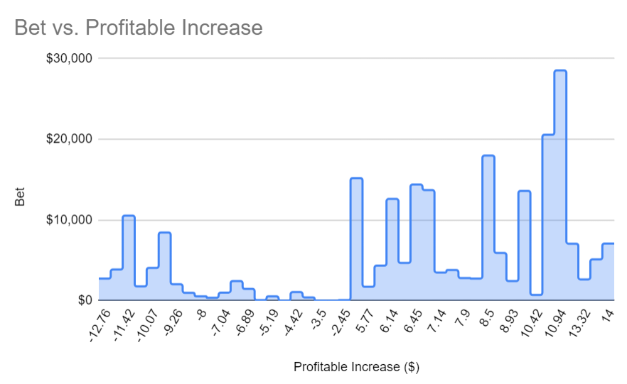

# 一个小白眼中的期权是什么

之前写过一些我眼里的期货，在[这里](https://liqul.github.io/mlllj/%E5%9F%BA%E7%A1%80%E7%9F%A5%E8%AF%86/%E6%9C%9F%E8%B4%A7/)。

期权从名字上看，与期货都有一个“期”字，可见它并不是当前时刻就要立刻采取行动的一种交易。而真正最大的区别突出在“权”字，它代表的是一种权利，而不是期货（或者现货）里的货物。
期权是指一种在一个期限内可行使的购买或销售权力，比如30天后，你可以以2000美元购买或销售一盎司黄金的权力。
一旦拥有了这项权力，在30天后，无论当时市场行情是多少，你都可以以这个约定的价格（2000美元一盎司）来购买或销售黄金。
如果到时候市场上的黄金是1900美元一盎司，而你持有购买期权，那你肯定不会真的行使这个权力，因为你会亏钱；但如果你持有的是销售期权，那你每盎司都能赚100美元，因为你可以以2000美元的价格来卖。

既然期权是一种交易，就一定有对手盘，一个买方和一个卖方。交易双方的收益和损失是对称的（仍然是零和游戏），但与期货和现货不同，期权交易双方的风险是不对称的。
在期权交易中，一方赚多少，另一方就会赔多少，但买方承担的风险是有限的，卖方承担的风险却可能是无限的。
在前面黄金的例子里，假设你持有看涨期权，而30天后黄金的价格疯狂地上涨到10000美元每盎司，那么你将赚到8000美元每盎司；而对应的卖出期权给你的交易者则亏损8000美元每盎司。
由于价格理论上是没有上限的，所以买方的收益是无上限的，所以卖方承担的是无限的风险。
而在购买期权时，买方需要支付一个价格来购买，如果30天后，黄金价格低于2000美元每盎司，则买方可以选择不行使权利，那么买方赔掉的仅仅是购买期权的成本，所以说是有限的风险。
看空期权也是类似的，只不过一般来说期权对应的底层交易品的价格不会低于0，所以看空期权的收益是有上限的。
从风险的角度来说，看空期权跟保险是一样的。买保险的时候，你支付给保险公司一笔固定的成本，而保险公司按照约定在一定的触发机制下支付你通常远超过成本的赔偿金。
表面上看，似乎卖方（无论是看多还是看空）承担的风险过大了，但实际上“买的不如卖的精”，很多出售期权的都是有一定实力的金融机构，正如大部分保险公司都是稳赚不赔的一样，除非发生了小概率事件。

期权的价格是怎么确定的呢？如果当前黄金的价格是2000美元一盎司，那么30天后1900美元一盎司的看涨期权的价格显然会高于100美元。
因为假如你手上持有这个期权，那么你就可以按1900美元买入一盎司黄金，然后以当前2000美元的市场价卖出去，净赚100美元，所以这个期权的价格就不可能低于100美元。
你可能察觉到有些不对劲，因为如果是30天后才到期，即使现在价格是2000美元，仍然无法确保到时候能赚到100美元每盎司，所以价格不一定高于100美元。
这样想是正确的，但这取决于行使权利的限制条件。在一些交易市场的真实的操作中，并不一定要求你持有期权到到期时间才能行使，而是在这个时间点之前的任意时间都可以。
行权的大部分时候也不是真的会有商品交易，而只是期权的卖方支付买方收益（如果价格走向有利于买方），而这张期权就此作废。
在这里，由于这100美元已经包含在期权的权益里了，所以称为“内在价值”。对于看涨期权，所有底层交易品价格低于当前市场价格的期权，都有其内在价值，也通常都会体现在期权价格上。

反过来，那些底层交易品价格高于当前市场价格的期权呢？它们的内在价值为0，但它们的价格可并非0，这个价格称为时间价格，我更愿意将其理解为一种机会成本。
例如对于一份30天后，2100美元一盎司黄金的看涨期权来说，由于当前黄金价格只有2000美元，所以要想获得收益，买方对于金价的预期一定是在30天内高于2100美元的，否则他不会去买这个期权。
如果大家目前对黄金极度看好，那么这份期权的价格就相对较高，反之因为无人问津则价格较低。
所以期权最终的价格是体现了内在价值和机会价值两个部分的，即两者相加的结果。
由于内在价值是完全确定的，所以期权价格的变数往往体现在机会成本上。
从期权的价格和购买情况可以看出交易者对于某种商品价格在未来变化上的预期，如果有大量交易者购买了某种商品的看涨期权，那么说明目前市场对该商品价格的预期是上行了；反之，
如果大量购买了某种商品的看跌期权，则市场预期该商品价格下行。
由于购买期权是真金白银地花钱，所以这种预期存在一定的参考价值，也就是大量交易者“用脚投票”的意思。

下图是2024年3月28日到期的QQQ option的价格，当前是2024年3月2日，收盘价格在445附近。

图的左半边是看涨期权（call option），右半边是看跌期权（put option）。
标记为蓝色的代表In-The-Money（ITM），白色的代表Out-The-Money（OTM），而交界处代表At-The-Money（ATM）。对于ITM期权，比如对于440的看涨期权，它的最新交易价格是11.61，那么它的内在价值是445 - 440 = 5，而它的时间价值是11.61 - 5 = 6.61；而对于OTM期权，比如440看跌期权，它的最新交易价格是4.96，所以它的时间价值就是价格本身，而它的内在价值为0。

期权的价格以最简单的方式计算，就是期权的内在价值（intrinsic value）加上期权的时间价值（time value）。怎么理解时间价值呢？这个价格反映了标的在未来走向某个价格的可能性，可能性越高则期权价格越高，反之越低。比如在上图中，因为当前的价格是445，那么越接近445行权价格的期权价格越高（8.5 call和6.89 put），离445越远则价格越低（除去一些低流动性的情况）。此外，离当前过期时间越远的期权，其时间价值就越高，比如3月28日的445看多期权的价格是8.5，而3月15日对应的价格是5.92。因为过期时间越长则变数越大，就意味着可能性也越大。

对于期权，最重要的一点是它的盈利价格，比如上图中的行权价格为445的看涨期权，其交易价格为8.5，所以要获得收益就意味着标的价格需要上涨到445+8.5=453.5以上，否则这张期权是亏损的。一般来说，对于看涨期权，随着它行权价格由小到大，它的收益价格也是逐渐增加的。下图展示了随着行权价上涨对应的盈利所需的标的价格上涨。比如，对于行权价格为435的看涨期权，因为它的交易价格是15.25，所以意味着需要标的价格需要从当前的445上涨5.25才能使得持有该期权的人盈利。

如果有一定数量的人持有某个行权价格的期权，那么意味着什么呢？抛开一些策略导致的影响，或许可以理解为他们花了一笔钱来押注标的价格会上涨（或下降）一定数量。比如在前面QQQ option的期权表中，可以想象成有2117人买了行权价格445$的看涨期权，意味着这里每人花了8.5$来打赌QQQ的价格至少上涨8.5$。但考虑ITM期权和OTM期权有些不同，例如对于行权价格在435$的期权，即使标的价格下降一些，虽然亏钱了，但还有可能避免赔掉所有本金，因为还有一定内在价值。比如，当标的价格下降到440$的时候，行权价格435$的看涨期权，其内在价值为440-435=5$，而且由于标的现在的价格440$（比起在445$时）更加靠近435$，所以时间价值会上涨，也就是说这时候如果持有人卖掉这份期权，那么他赔掉的钱不会超过5$。所以对于ITM期权，比如435$的看涨期权，它的盈利价格是435+15.25=450.25$，也就是需要在目前的基础上再上涨5.25$，而购买这份期权的押注应该比15.25$要小，甚至应该小于5.25$，但姑且以5.25$为估计。当然，对应OTM期权，其押注也是低于价格的，因为购买者不必要等到期权变成ITM才能盈利，随着标的价格上涨，期权的时间价值上升了，所以这时候如果卖掉就已经盈利了。

不管怎么说，我觉得可以用时间价值来估算交易者押注的大小。这样一来，我们就可以画出下面这张图：

这张图的x坐标轴代表期权的盈利价格跟当前价格的差值。对于看空期权，它对应的x坐标轴上的负值部分，也就是需要价格下降才会盈利；而正值部分对应看涨期权。y坐标轴代表当前的押注情况，每一个x取值对应的y值代表`持仓数量*时间价值`。从这张图上看，大多数的人认为标的价格会上涨。

## 期权的组合

